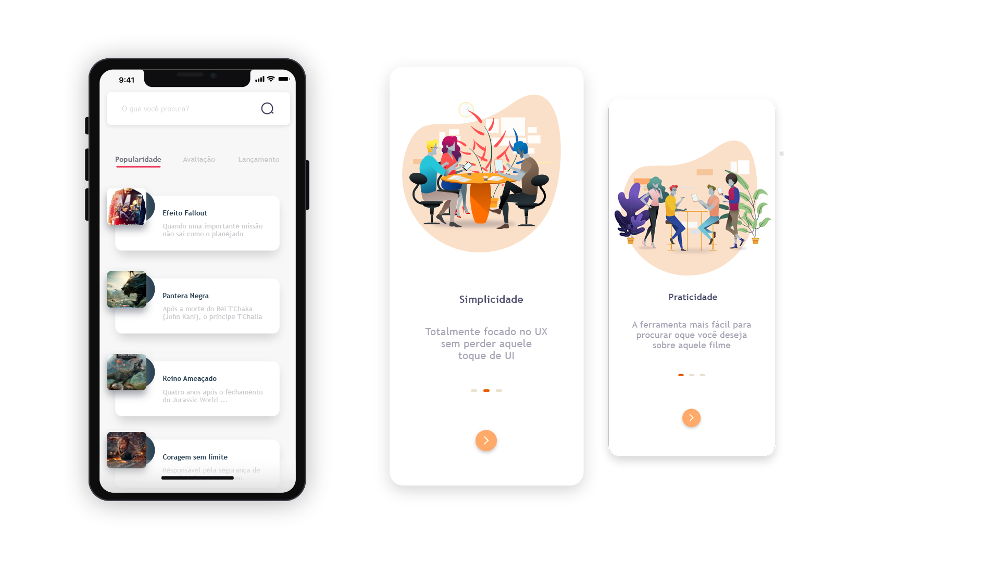

Movie Cine
=============

**Movie Cine** app simples, mas muito prático. Este aplicativo é pra você que deseja toda informação daquele filme em um só lugar, pensado na usabilidade e praticidade de ter a informação que você precisa.

	Este projeto foi gerado com [CLI Angular] versao 6.1.1

## Servidor de desenvolvimento

Execute `ionic serve` para um servidor dev. Navegue até `http: // localhost:8100 /`. O aplicativo será recarregado automaticamente se você alterar qualquer um dos arquivos de origem.

## Code scaffolding

Run `ionic generate component component-name` to generate a new component. You can also use `ionic generate component directive|pipe|page|tabs`.

## Build

BuildRun `ng build` para construir o projeto. Os artefatos de construção serão armazenados no diretório `dist /`. Use o sinalizador `--prod` para uma construção de produção.

## Further help

To get more help on the Angular CLI use `ng help` or go check out the [Angular CLI README](https://github.com/angular/angular-cli/blob/master/README.md).
